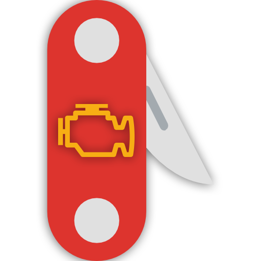

# edc15-swiss-knife

A set of tools I use for making custom maps for the EDC15 engine control units.
Most of the tools are to be used alongside of EDCSuite, but some are for
converting between EDCSuite and WinOLS.

Build with this command (on Windows):

```bash
pyinstaller --clean --collect-all tools --add-data 'tools/lib/*;tools/lib/' --noconfirm --noconsole .\main.py
```

Icon from: https://www.flaticon.com/free-icon/swiss-army-knife_222425